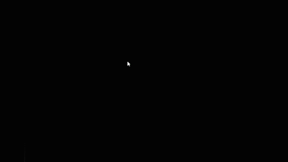

# Demos of my projects

## Tank game

* 2 weapons - rocket and machine gun
* 3 types of monsters - from big and slow to small and fast
* monsters are following player

## 3DActionTutorial

* Room with obstacles
* Monster reacts on player (shoots orange balls if nearby)
* Click - shoot (you can see balls are created on walls)

## Rectangle Relationship

* Click on empty field - create rectangle
* Click and drag rectangle - move rectangle
* Double click on rectangle - delete this rectangle
* Click on point of rectangle
	* First click - start creating realtionship beetwen rectangles
	* Second click (on point of another rectangle) - finish creating realtionship beetwen rectangles
* Double click on line between rectangles - delete this line
